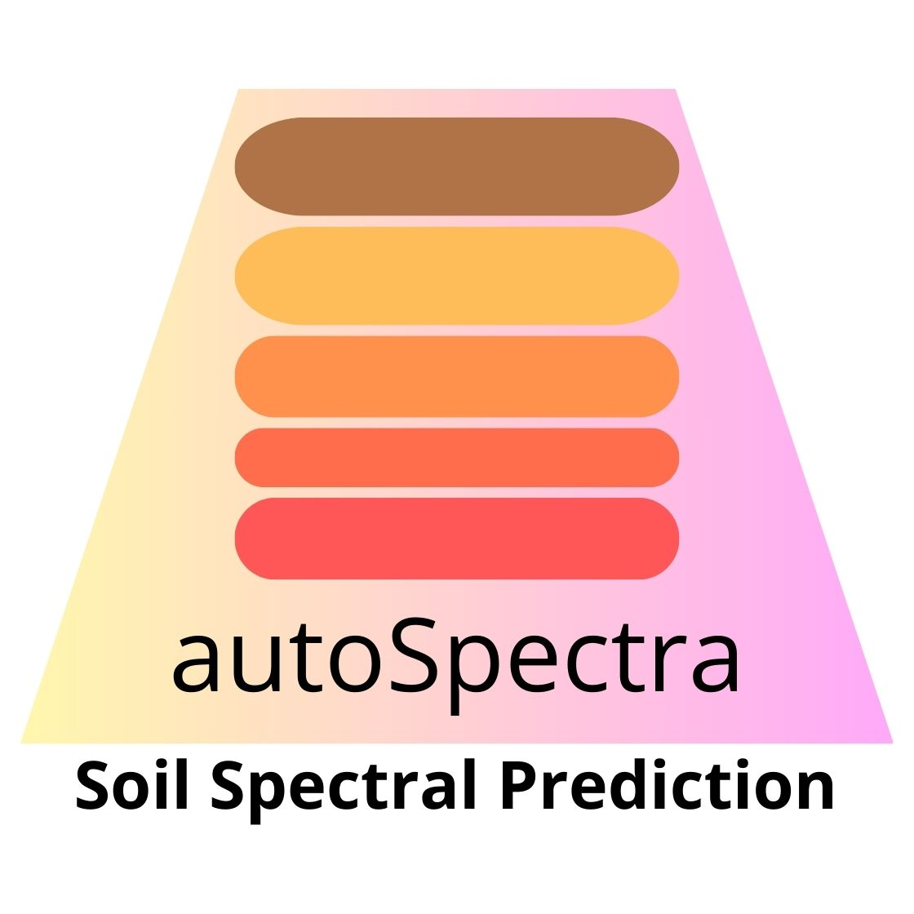

# autoSpectra 

<!-- badges: start -->
[](https://CRAN.R-project.org/package=autoSpectra)
[](https://CRAN.R-project.org/package=autoSpectra)
[](https://github.com/HugoMachadoRodrigues/autoSpectra/releases)
[](LICENSE)
[](https://doi.org/10.5281/zenodo.XXXXXXX)
[](https://www.r-project.org/)
[](https://docs.soilspectroscopy.org)
[](https://orcid.org/0000-0002-8070-8126)
[](https://github.com/HugoMachadoRodrigues/autoSpectra/actions/workflows/R-CMD-check.yml)
[](https://HugoMachadoRodrigues.github.io/autoSpectra/)
<!-- badges: end -->

> **Soil spectral modeling, visualization, and prediction** — powered by the Open Soil Spectral Library (OSSL v1.2) and soilVAE asymmetric autoencoders, with sensor-agnostic support for VisNIR and MIR spectroscopy.

---

## Table of Contents

1. [Overview](#overview)
2. [Architecture](#architecture)
3. [Model Families](#model-families)
4. [Soil Properties](#soil-properties)
5. [Preprocessing Pipeline](#preprocessing-pipeline)
6. [OSSL Data Sources](#ossl-data-sources)
7. [Installation](#installation)
8. [Quick Start](#quick-start)
9. [Shiny Interface](#shiny-interface)
10. [Versioning](#versioning)
11. [Data Citations](#data-citations)
12. [Software Citation](#software-citation)
13. [License](#license)

---

## Overview

**autoSpectra** is an R package and interactive Shiny application for predicting soil physical and chemical properties from diffuse reflectance spectra. It supports two spectral domains:

| Domain | Range | Units | OSSL grid |
|--------|-------|-------|-----------|
| **VisNIR** (Visible + Near-Infrared) | 350 – 2500 nm | Reflectance (→ Absorbance) | 1 076 bands at 2 nm |
| **MIR** (Mid-Infrared) | 600 – 4000 cm⁻¹ | Absorbance | 1 701 bands at 2 cm⁻¹ |

The core predictive model is **soilVAE** — an asymmetric autoencoder with a dedicated prediction head — trained on data from the [Open Soil Spectral Library (OSSL) v1.2](https://docs.soilspectroscopy.org). Models are sensor-agnostic: they were trained on contributions from dozens of instruments worldwide, all harmonized to the OSSL standard grid.

---

## Architecture

### soilVAE — Asymmetric Autoencoder

The model learns a compact latent representation of the spectrum and simultaneously reconstructs the input and predicts the target soil property. The split design separates the representation task from prediction, reducing overfitting and enabling applicability-domain assessment.

```
Input spectrum (d_in bands, preprocessed)
        │
        ▼
  ┌─────────────┐
  │  Dense 256  │  ReLU
  │  Dense 128  │  ReLU
  │  Dense  64  │  ReLU
  │  Dense  16  │  ReLU  ← Latent space (z)
  └──────┬──────┘
         │
    ┌────┴────────────────────┐
    │                         │
    ▼  Reconstruction head    ▼  Prediction head
 Dense 32                  Dense 64
 Dense d_in  (linear)      Dropout 5%
 ↑ MSE loss (w=0.3)        Dense 1  (linear)
                            ↑ MSE loss (w=0.3)
```

- **Latent dimension**: 16  
- **Optimizer**: Adam  
- **Early stopping**: patience = 8 epochs (monitors `val_loss`)  
- **LR reduction**: ×0.5 when plateau, patience = 4, min LR = 1×10⁻⁵  

### Applicability Domain

The latent vectors of the training set define a multivariate Gaussian distribution (μ, Σ). For any new sample, the squared Mahalanobis distance in latent space is compared against the χ² threshold at df = 16, α = 0.05:

```
D²(z) = (z − μ)ᵀ Σ⁻¹ (z − μ)   →   D² ≤ χ²(16, 0.95) ≈ 26.3  ✓ in domain
```

Conformal prediction intervals (q90, q95 of absolute calibration residuals) are saved alongside each model for uncertainty quantification.

---

## Model Families

autoSpectra ships with **7 model families**:

| Family ID | Source | Sensor(s) | Moisture | Spectral range | Bands | Properties |
|-----------|--------|-----------|----------|----------------|-------|------------|
| `OSSL_VisNIR` | OSSL v1.2 | All instruments | Agnostic | 350 – 2500 nm | 1 076 | 34 (L1) |
| `OSSL_MIR` | OSSL v1.2 | All instruments | Agnostic | 600 – 4000 cm⁻¹ | 1 701 | 34 (L1) |
| `Agnostic_DRY` | Local | ASD + NaturaSpec + NeoSpectra | DRY | 1350 – 2500 nm | 1 151 | 23 |
| `Agnostic_Moisture` | Local | ASD + NaturaSpec + NeoSpectra | DRY + 1ML + 3ML | 1350 – 2500 nm | 1 151 | 23 |
| `ASD_DRY` | Local | ASD FieldSpec | DRY | 350 – 2500 nm | 2 151 | 23 |
| `NeoSpectra_DRY` | Local | Si-Ware NeoSpectra | DRY | 1350 – 2500 nm | 1 151 | 23 |
| `NaturaSpec_DRY` | Local | NaturaSpec | DRY | 350 – 2500 nm | 2 151 | 23 |

> **OSSL families** are the recommended choice for new projects. They cover the full breadth of global soil diversity and any VisNIR/MIR instrument.

---

## Soil Properties

### OSSL Level-1 Harmonized Properties (34 targets)

| Category | Variable | Unit | Description |
|----------|----------|------|-------------|
| **Organic** | `oc` | w.pct | Organic carbon |
| | `c.tot` | w.pct | Total carbon |
| | `n.tot` | w.pct | Total nitrogen |
| **Texture** | `clay.tot` | w.pct | Total clay (<0.002 mm) |
| | `silt.tot` | w.pct | Total silt (0.002–0.05 mm) |
| | `sand.tot` | w.pct | Total sand (0.05–2 mm) |
| **Reaction** | `ph.h2o` | index | pH in water |
| | `ph.cacl2` | index | pH in CaCl₂ |
| | `caco3` | w.pct | Calcium carbonate |
| | `acidity` | cmolc/kg | Exchangeable acidity |
| | `ec` | dS/m | Electrical conductivity |
| **Physical** | `bd` | g/cm³ | Bulk density |
| | `aggstb` | w.pct | Aggregate stability |
| | `awc.33.1500kPa` | w.frac | Available water content |
| | `wr.33kPa` | w.pct | Water retention at 33 kPa |
| | `wr.1500kPa` | w.pct | Water retention at 1500 kPa |
| **Exchange** | `cec` | cmolc/kg | Cation exchange capacity |
| | `ca.ext` | mg/kg | Extractable calcium |
| | `k.ext` | mg/kg | Extractable potassium |
| | `mg.ext` | mg/kg | Extractable magnesium |
| | `na.ext` | mg/kg | Extractable sodium |
| **Micro­nutrients** | `p.ext` | mg/kg | Extractable phosphorus |
| | `fe.ext` | mg/kg | Extractable iron |
| | `fe.dith` | w.pct | Crystalline iron (dithionite) |
| | `fe.ox` | w.pct | Amorphous iron (oxalate) |
| | `al.ext` | mg/kg | Extractable aluminum |
| | `al.ox` | w.pct | Amorphous aluminum |
| | `al.dith` | w.pct | Crystalline aluminum |
| | `mn.ext` | mg/kg | Extractable manganese |
| | `zn.ext` | mg/kg | Extractable zinc |
| | `cu.ext` | mg/kg | Extractable copper |
| | `b.ext` | mg/kg | Extractable boron |
| | `s.tot` | w.pct | Total sulfur |
| | `s.ext` | mg/kg | Extractable sulfur |

### Local legacy properties (23 targets, backward compatible)

`soil_texture_sand`, `soil_texture_silt`, `soil_texture_clay`, `organic_matter`, `soc`, `total_c`, `total_n`, `active_carbon`, `ph`, `p`, `k`, `mg`, `fe`, `mn`, `zn`, `al`, `Ca`, `Cu`, `S`, `B`, `pred_soil_protein`, `respiration`, `bd_ws`

---

## Preprocessing Pipeline

The canonical two-step Savitzky-Golay pipeline is applied to all spectra before training or prediction. The steps differ by spectral domain:

```
VisNIR (reflectance input)              MIR (absorbance input)
─────────────────────────────           ───────────────────────────
  Raw reflectance R ∈ [0,1]              Raw absorbance A
          │                                      │
          ▼                                      │
  A = −ln(R)   (absorbance)                      │
          │                                      │
          ▼                                      ▼
  SG smooth  [ window=23, poly=2, d=0 ]  SG smooth  [ window=23, poly=2, d=0 ]
          │                                      │
          ▼                                      ▼
  SG 1st deriv [ window=23, poly=2, d=1 ]SG 1st deriv [ window=23, poly=2, d=1 ]
          │                                      │
          ▼                                      ▼
  Model input (1 076 features)           Model input (1 701 features)
```

> **Window size**: The Savitzky-Golay half-window `m = 11` gives a total window of 2×11+1 = **23 points**.  
> The two-step approach (smooth first, then derivative) provides cleaner noise removal compared to a single-pass derivative filter.

Encoded as pipeline strings in `model_registry`:
```r
# VisNIR
preprocess = c("ABSORBANCE", "SG_SMOOTH(11,2)", "SG_DERIV(11,2,1)")

# MIR
preprocess = c("SG_SMOOTH(11,2)", "SG_DERIV(11,2,1)")
```

---

## OSSL Data Sources

All OSSL v1.2 data are publicly available under [CC-BY 4.0](https://creativecommons.org/licenses/by/4.0/).

| Component | File | URL |
|-----------|------|-----|
| VisNIR spectra (L0) | `ossl_visnir_L0_v1.2.csv.gz` | `https://storage.googleapis.com/soilspec4gg-public/ossl_visnir_L0_v1.2.csv.gz` |
| MIR spectra (L0) | `ossl_mir_L0_v1.2.csv.gz` | `https://storage.googleapis.com/soilspec4gg-public/ossl_mir_L0_v1.2.csv.gz` |
| Soil lab data (L1) | `ossl_soillab_L1_v1.2.csv.gz` | `https://storage.googleapis.com/soilspec4gg-public/ossl_soillab_L1_v1.2.csv.gz` |
| Combined (all) | `ossl_all_L1_v1.2.csv.gz` | `https://storage.googleapis.com/soilspec4gg-public/ossl_all_L1_v1.2.csv.gz` |

The `ossl_download()` function handles fetching and local caching automatically:

```r
ossl_download()          # downloads VisNIR + MIR + soillab (~2 GB total)
ossl_download("visnir")  # VisNIR only
ossl_download("mir")     # MIR only
```

### OSSL harmonization levels

| Level | Description |
|-------|-------------|
| **L0** | Original values as contributed by each dataset |
| **L1** | Harmonized to common units, outlier-filtered, consistent naming |

> autoSpectra uses **L0 spectra** (original reflectance/absorbance) and **L1 soil lab** (harmonized properties). The spectral preprocessing (absorbance conversion + two-step SG) is applied within the package rather than relying on pre-processed OSSL spectra.

---

## Installation

### From GitHub (recommended)

```r
# Install devtools if needed
install.packages("devtools")

# Install autoSpectra
devtools::install_github("HugoMachadoRodrigues/autoSpectra")
```

### Dependencies

| Package | Role | Install |
|---------|------|---------|
| `shiny`, `shinyWidgets` | Interactive interface | CRAN |
| `ggplot2` | Visualization | CRAN |
| `prospectr` | Savitzky-Golay filter | CRAN |
| `keras` + `tensorflow` | soilVAE training & inference | See below |
| `httr` | OSSL data download | CRAN |
| `data.table` | Fast CSV loading | CRAN |
| `readxl`, `writexl` | Excel I/O | CRAN |
| `DT`, `jsonlite` | Tables & JSON | CRAN |

**Setting up Keras/TensorFlow** (required for model training and prediction):

```r
install.packages("keras")
keras::install_keras()        # installs TensorFlow in a virtualenv
```

---

## Quick Start

### 1. Download OSSL data and train models

```r
library(autoSpectra)

# Download OSSL v1.2 data (~2 GB, cached locally)
ossl_download()

# Train soilVAE models for all 34 properties × VisNIR
train_ossl_models("OSSL_VisNIR")

# Train soilVAE models for all 34 properties × MIR
train_ossl_models("OSSL_MIR")
```

Or run the bundled script from the project root:

```bash
Rscript train_ossl.R
```

### 2. Predict from new spectra (programmatic)

```r
library(autoSpectra)

# Load your spectral data (Soil_ID column + numeric wavelength columns)
df <- readxl::read_excel("my_spectra.xlsx")

# Predict with the OSSL VisNIR agnostic model
results <- predict_soil(df, family_id = "OSSL_VisNIR",
                        properties = c("oc", "clay.tot", "ph.h2o"))
print(results)

# Check applicability domain for organic carbon
app <- predict_applicability(df, "OSSL_VisNIR", "oc")
plot_applicability(app)

# Plot spectra
plot_spectra(df, family = get_family("OSSL_VisNIR"))
```

### 3. Launch the interactive app

```r
run_autoSpectra()
```

---

## Shiny Interface

The app provides a four-tab workflow:

| Tab | Description |
|-----|-------------|
| **Preview** | Summary info about the uploaded file and detected spectral columns |
| **Spectrum viewer** | Per-sample spectral plot with model grid overlay |
| **Mean spectrum** | Mean ± SD ribbon across all uploaded samples |
| **Predictions** | Table of predicted soil properties, downloadable as Excel |

**Supported upload formats**: `.xlsx`, `.xls`, `.csv`

**Expected file format**:

```
Soil_ID  | 350  | 352  | 354  | ... | 2500
---------|------|------|------|-----|------
Sample_1 | 0.12 | 0.13 | 0.14 | ... | 0.08
Sample_2 | 0.18 | 0.19 | 0.20 | ... | 0.11
```

> Column headers must be the wavelength/wavenumber positions (numeric). The `Soil_ID` column name is configurable in the sidebar.

---

## Versioning

### v0.2.0 — 2026-03-13 *(current)*

**Major: R package + OSSL integration**

- Converted from standalone Shiny app to a proper **R package**
- Added **OSSL v1.2** data download and integration (`ossl_download()`, `ossl_prepare()`)
- New model families: **`OSSL_VisNIR`** (350–2500 nm) and **`OSSL_MIR`** (600–4000 cm⁻¹)
- Expanded to **34 OSSL L1 soil properties** (was 23 local properties)
- **Two-step SG preprocessing**: separated smooth pass (`SG_SMOOTH`) and derivative pass (`SG_DERIV`) for explicit control
- Added **MIR support** throughout (app, training, prediction)
- Added `predict_applicability()` for Mahalanobis applicability domain
- Added `plot_applicability()`, `plot_mean_spectrum()`, `plot_predictions()` visualization functions
- Backward compatible: all local families (ASD, NeoSpectra, NaturaSpec) still work

### v0.1.0 — 2025

**Initial release: Shiny application**

- Interactive Shiny app for soil spectral prediction
- **5 local model families**: `ASD_DRY`, `NeoSpectra_DRY`, `NaturaSpec_DRY`, `Agnostic_DRY`, `Agnostic_Moisture`
- **23 soil properties** (local training data)
- Preprocessing: Reflectance → Absorbance → SG(11, 2, 1st derivative)
- soilVAE asymmetric autoencoder architecture
- Conformal prediction intervals (q90, q95)
- Excel and CSV upload, prediction download

---

## Data Citations

If you use autoSpectra with OSSL data, please cite:

### Open Soil Spectral Library (OSSL)

```bibtex
@article{Safanelli2023,
  title   = {Open Soil Spectral Library},
  author  = {Safanelli, José Lucas and Hengl, Tomislav and
             Parente, Leandro and Minarik, Robert and
             Bloom, David E. and Todd-Brown, Katherine and
             Gholizadeh, Asa and others},
  journal = {Earth System Science Data},
  year    = {2023},
  doi     = {10.5194/essd-15-3829-2023},
  url     = {https://docs.soilspectroscopy.org}
}
```

### prospectr (Savitzky-Golay filter)

```bibtex
@article{Stevens2014,
  title   = {An Introduction to the prospectr Package},
  author  = {Stevens, Antoine and Ramirez-Lopez, Leonardo},
  journal = {R package vignette},
  year    = {2014},
  url     = {https://CRAN.R-project.org/package=prospectr}
}
```

### TensorFlow / Keras

```bibtex
@software{tensorflow2015,
  title  = {{TensorFlow}: Large-Scale Machine Learning on Heterogeneous Systems},
  author = {Abadi, Martín and others},
  year   = {2015},
  url    = {https://www.tensorflow.org}
}
```

---

## Author

**Hugo Rodrigues**  
[](https://orcid.org/0000-0002-8070-8126)
[](https://twitter.com/Hugo_MRodrigues)

---

## Software Citation

If you use autoSpectra in your research, please cite:

```bibtex
@software{Rodrigues2026autoSpectra,
  title   = {autoSpectra: Soil Spectral Modelling, Visualization and Prediction},
  author  = {Rodrigues, Hugo},
  year    = {2026},
  version = {0.2.0},
  doi     = {10.5281/zenodo.XXXXXXX},
  url     = {https://github.com/HugoMachadoRodrigues/autoSpectra},
  license = {MIT},
  note    = {ORCID: 0000-0002-8070-8126}
}
```

> A formatted citation is also available via `citation("autoSpectra")` in R.

---

## Contributing

Contributions are welcome! To add a new model family, extend the `model_registry` in `R/registry.R`. To report bugs or request features, please open an issue on GitHub.

---

## License

MIT © 2025–2026 Hugo Rodrigues. See [LICENSE](LICENSE).

The OSSL data accessed by this package is distributed under [CC-BY 4.0](https://creativecommons.org/licenses/by/4.0/).

---

<p align="center">
  
</p>

<p align="center">
  Made with ❤️ and 🌱 soil science · <a href="https://twitter.com/Hugo_MRodrigues">@Hugo_MRodrigues</a>
</p>
