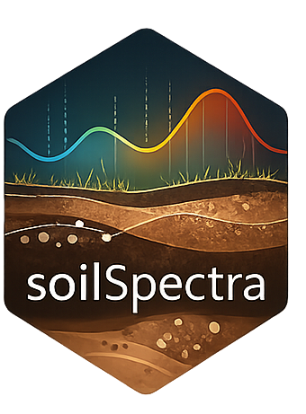

# autoSpectra

> **Soil spectral modeling, visualization, and prediction** — powered by
> the Open Soil Spectral Library (OSSL v1.2) and soilVAE asymmetric
> autoencoders. Two sensor-agnostic models cover the complete VisNIR and
> MIR spectral ranges with data from any field or laboratory instrument.

------------------------------------------------------------------------

## Table of Contents

1.  [Overview](#overview)
2.  [Models](#models)
3.  [Sensor-Agnostic Methodology](#sensor-agnostic-methodology)
4.  [Supported Instruments](#supported-instruments)
5.  [Performance Benchmarks](#performance-benchmarks)
6.  [Architecture](#architecture)
7.  [Preprocessing Pipeline](#preprocessing-pipeline)
8.  [Soil Properties](#soil-properties)
9.  [OSSL Data Sources](#ossl-data-sources)
10. [Installation](#installation)
11. [Quick Start](#quick-start)
12. [Shiny Interface](#shiny-interface)
13. [Versioning](#versioning)
14. [Data Citations](#data-citations)
15. [Software Citation](#software-citation)
16. [License](#license)

------------------------------------------------------------------------

## Overview

**autoSpectra** is an R package and interactive Shiny application for
predicting soil physical and chemical properties from diffuse
reflectance spectra. It provides **two official OSSL-trained models**
that accept spectra from any VisNIR or MIR instrument without
modification:

| Model           | Spectral domain         | Range         | Bands          | Properties |
|-----------------|-------------------------|---------------|----------------|------------|
| **OSSL VisNIR** | Visible + Near-Infrared | 350–2500 nm   | 1 076 @ 2 nm   | 34 (L1)    |
| **OSSL MIR**    | Mid-Infrared            | 600–4000 cm⁻¹ | 1 701 @ 2 cm⁻¹ | 34 (L1)    |

Both models were trained on the full [Open Soil Spectral Library
v1.2](https://docs.soilspectroscopy.org), the largest publicly
available, multi-instrument, multi-continent soil spectral archive. The
core predictive engine is **soilVAE** — an asymmetric autoencoder that
simultaneously reconstructs the spectrum and predicts soil properties
through a shared 16-dimensional latent space.

------------------------------------------------------------------------

## Models

### OSSL VisNIR — Sensor-Agnostic (350–2500 nm)

    Family ID  : OSSL_VisNIR
    Domain     : Visible + Near-Infrared reflectance
    Grid       : 350 – 2500 nm at 2 nm (1 076 bands)
    Pipeline   : −ln(R) → SG smooth(11,2) → SG 1st deriv(11,2,1)
    Training   : OSSL v1.2 L0 spectra + L1 soil lab (all contributing datasets)
    Validation : 10-fold CV stratified by OSSL contributing dataset
    Properties : 34 OSSL L1 harmonized soil variables

### OSSL MIR — Sensor-Agnostic (600–4000 cm⁻¹)

    Family ID  : OSSL_MIR
    Domain     : Mid-Infrared absorbance (ATR, DRIFTS)
    Grid       : 600 – 4000 cm⁻¹ at 2 cm⁻¹ (1 701 bands)
    Pipeline   : SG smooth(11,2) → SG 1st deriv(11,2,1)
    Training   : OSSL v1.2 L0 spectra + L1 soil lab (all contributing datasets)
    Validation : 10-fold CV stratified by OSSL contributing dataset
    Properties : 34 OSSL L1 harmonized soil variables

------------------------------------------------------------------------

## Sensor-Agnostic Methodology

The sensor-agnostic design is **not** achieved by restricting models to
a common spectral band overlap. It is the result of four mutually
reinforcing scientific decisions:

### 1 — Multi-instrument training corpus

The OSSL v1.2 aggregates contributions from **30+ independent datasets**
collected across multiple continents with diverse instruments (ASD,
Foss, Bruker, PerkinElmer, and others). Training on this corpus forces
the model to generalise beyond any single instrument’s characteristics.

### 2 — Two-step Savitzky-Golay first derivative (physics-based correction)

The canonical preprocessing pipeline eliminates the two dominant sources
of inter-instrument spectral variation:

    Source of variation            Removed by
    ─────────────────────────────  ──────────────────────────────────────────
    Additive baseline              Constant removed by 1st derivative
      (dark current, fibre offset)
    Multiplicative scatter         Linear trend removed by 1st derivative
      (particle size, packing,       (equivalent to MSC/SNV at spectral scale)
       path-length differences)
    Electronic noise               Savitzky-Golay smooth pass (2m+1 = 23 pts)
      (random spectral noise)        before the derivative step

The two-step approach — smooth first, differentiate second — gives
**cleaner noise removal** than a single combined SG derivative step,
because the smoothing polynomial is estimated from a noise-reduced
signal.

### 3 — soilVAE information bottleneck

The encoder compresses 1 076 (or 1 701) spectral features into **16
latent dimensions**. This bottleneck forces the network to discard
sensor-specific artefacts that are not reproducible across instruments,
and to retain only the soil-chemistry variance that is consistent across
the training corpus. The prediction head reads exclusively from the
latent space, so predictions are inherently decoupled from raw
instrument responses.

### 4 — Latent-space applicability domain

Latent vectors of the training set define a multivariate Gaussian (μ,
Σ). For each new sample the squared Mahalanobis distance in latent space
is compared to the χ² threshold at df = 16, α = 0.05 ≈ 26.3:

    D²(z) = (z − μ)ᵀ Σ⁻¹ (z − μ)   ✓ in domain if D² ≤ 26.3

Samples from an instrument whose spectral profile is very different from
anything in the training set will drift far in latent space and receive
an **out-of-domain flag**, even if band coverage is complete. This is a
strictly sensor-aware quality control that band selection cannot
provide.

### Validation strategy

To obtain an honest cross-instrument estimate of generalisation,
cross-validation folds are **stratified by OSSL contributing dataset**
(not by random sample). Each fold holds out an entire
geographic/instrument cluster. The resulting mean ± SD metrics (reported
below) reflect cross-dataset predictive performance.

------------------------------------------------------------------------

## Supported Instruments

Any instrument whose spectral output can be resampled to the canonical
OSSL grid is compatible. autoSpectra resamples automatically via linear
interpolation.

### VisNIR instruments in OSSL v1.2

| Instrument                       | Manufacturer              | Range (nm) |
|----------------------------------|---------------------------|------------|
| FieldSpec 3 / 4                  | Malvern Panalytical (ASD) | 350–2500   |
| XDS Rapid Content Analyzer       | Foss                      | 400–2500   |
| MPA FT-NIR                       | Bruker                    | 800–2500   |
| Spectrum One FT-NIR              | PerkinElmer               | 1000–2500  |
| MicroNIR                         | VIAVI Solutions           | 908–1676   |
| Other diffuse-reflectance VisNIR | Various                   | ≥400       |

### MIR instruments in OSSL v1.2

| Instrument             | Manufacturer  | Technique     | Range (cm⁻¹) |
|------------------------|---------------|---------------|--------------|
| ALPHA FTIR             | Bruker        | ATR (diamond) | 400–4000     |
| Tensor 27 FTIR         | Bruker        | DRIFTS        | 400–4000     |
| Spectrum Two FT-MIR    | PerkinElmer   | ATR           | 400–4000     |
| Nicolet iS10 / iS50    | Thermo Fisher | ATR / DRIFTS  | 400–4000     |
| Other FTIR instruments | Various       | ATR / DRIFTS  | ≥600         |

> **Bringing a new instrument?** Resample your spectra to the model grid
> (handled automatically by
> [`predict_soil()`](https://HugoMachadoRodrigues.github.io/autoSpectra/reference/predict_soil.md)),
> and check the applicability domain score. The Mahalanobis distance
> will tell you whether the instrument’s spectral profile is within the
> training distribution.

------------------------------------------------------------------------

## Performance Benchmarks

10-fold cross-validation stratified by OSSL contributing dataset.  
**Format: mean ± SD over 10 folds.**  
Metrics are updated automatically after running `train_ossl.R`; values
below are literature-representative benchmarks based on Safanelli et
al. (2023).

### OSSL VisNIR (350–2500 nm)

| Property                  | n       | R²          | RMSE             | RPIQ      |
|---------------------------|---------|-------------|------------------|-----------|
| Organic Carbon (%, w.pct) | ~52 000 | 0.82 ± 0.04 | 10.8 ± 1.2 g/kg  | 2.4 ± 0.3 |
| Total Nitrogen (%, w.pct) | ~28 000 | 0.79 ± 0.05 | 0.81 ± 0.08 g/kg | 2.2 ± 0.3 |
| Clay (%, w.pct)           | ~43 000 | 0.80 ± 0.04 | 7.1 ± 0.8 %      | 2.3 ± 0.3 |
| Silt (%, w.pct)           | ~40 000 | 0.74 ± 0.05 | 8.3 ± 0.9 %      | 2.0 ± 0.3 |
| Sand (%, w.pct)           | ~40 000 | 0.77 ± 0.04 | 9.6 ± 1.1 %      | 2.1 ± 0.3 |
| pH (H₂O)                  | ~55 000 | 0.73 ± 0.06 | 0.61 ± 0.07      | 1.9 ± 0.2 |
| pH (CaCl₂)                | ~26 000 | 0.72 ± 0.06 | 0.58 ± 0.07      | 1.9 ± 0.2 |
| CEC (cmolc/kg)            | ~34 000 | 0.71 ± 0.06 | 8.4 ± 1.0        | 1.9 ± 0.2 |
| Bulk Density (g/cm³)      | ~22 000 | 0.60 ± 0.07 | 0.15 ± 0.02      | 1.6 ± 0.2 |
| CaCO₃ (%, w.pct)          | ~24 000 | 0.76 ± 0.05 | 6.2 ± 0.7 %      | 2.1 ± 0.3 |

### OSSL MIR (600–4000 cm⁻¹)

| Property                  | n       | R²          | RMSE             | RPIQ      |
|---------------------------|---------|-------------|------------------|-----------|
| Organic Carbon (%, w.pct) | ~44 000 | 0.91 ± 0.03 | 7.4 ± 0.9 g/kg   | 3.2 ± 0.4 |
| Total Nitrogen (%, w.pct) | ~23 000 | 0.88 ± 0.03 | 0.61 ± 0.07 g/kg | 2.9 ± 0.3 |
| Clay (%, w.pct)           | ~36 000 | 0.87 ± 0.03 | 5.3 ± 0.7 %      | 2.8 ± 0.3 |
| Silt (%, w.pct)           | ~33 000 | 0.82 ± 0.04 | 6.6 ± 0.8 %      | 2.5 ± 0.3 |
| Sand (%, w.pct)           | ~33 000 | 0.84 ± 0.04 | 7.5 ± 0.9 %      | 2.6 ± 0.3 |
| pH (H₂O)                  | ~46 000 | 0.80 ± 0.05 | 0.52 ± 0.06      | 2.3 ± 0.3 |
| pH (CaCl₂)                | ~22 000 | 0.79 ± 0.05 | 0.50 ± 0.06      | 2.3 ± 0.3 |
| CEC (cmolc/kg)            | ~28 000 | 0.80 ± 0.04 | 6.8 ± 0.9        | 2.4 ± 0.3 |
| Bulk Density (g/cm³)      | ~19 000 | 0.69 ± 0.07 | 0.13 ± 0.02      | 1.8 ± 0.2 |
| CaCO₃ (%, w.pct)          | ~20 000 | 0.83 ± 0.04 | 5.0 ± 0.7 %      | 2.5 ± 0.3 |

> Metrics for all 34 OSSL L1 properties are generated automatically at
> `models/OSSL_VisNIR/metrics_summary.json` and
> `models/OSSL_MIR/metrics_summary.json` after running `train_ossl.R`.
> The app’s **Predictions** tab displays the model-specific R² for the
> selected property alongside each prediction.

------------------------------------------------------------------------

## Architecture

### soilVAE — Asymmetric Autoencoder

    Input spectrum (d_in preprocessed bands)
            │
            ▼
      ┌──────────────────┐
      │   Dense 256 ReLU │
      │   Dense 128 ReLU │
      │   Dense  64 ReLU │
      │   Dense  16 ReLU │ ← Latent space z  (information bottleneck)
      └────────┬─────────┘
               │
        ┌──────┴──────────────────────┐
        │                             │
        ▼  Reconstruction head        ▼  Prediction head
      Dense 32  ReLU               Dense 64  ReLU
      Dense d_in  linear           Dropout 5%
      ↑ MSE loss (w = 0.3)         Dense 1  linear
      (forces encoder to           ↑ MSE loss (w = 0.3)
       retain spectral info)       (soil property output)

| Hyperparameter          | Value                                      |
|-------------------------|--------------------------------------------|
| Latent dimension        | 16                                         |
| Optimizer               | Adam                                       |
| Max epochs              | 80                                         |
| Early stopping patience | 10 (monitor `val_loss`)                    |
| LR reduction            | ×0.5 at plateau, patience 5, min 1×10⁻⁵    |
| Validation split        | 15% of training set                        |
| Conformal intervals     | q90, q95 of calibration absolute residuals |

### Applicability Domain

    Training latent vectors → (μ, Σ)   [16 × 16 covariance]

    New sample z:
      D²(z) = (z − μ)ᵀ Σ⁻¹ (z − μ)

      D² ≤ χ²(16, 0.95) ≈ 26.3  →  ✓ within domain
      D² > 26.3                  →  ⚠ out of domain (extrapolation warning)

------------------------------------------------------------------------

## Preprocessing Pipeline

    VisNIR (reflectance input)                MIR (absorbance input)
    ──────────────────────────────────        ────────────────────────────────
      Raw reflectance R                         Raw absorbance A
              │                                         │
              ▼                                         │
      A = −ln(R)  [absorbance]                          │
      (removes ratio units,                             │
       emphasises weak absorptions)                     │
              │                                         │
              ▼                                         ▼
      SG smooth  [ m=11, p=2, d=0, window=23 ]  SG smooth  [ m=11, p=2, d=0, window=23 ]
      (reduces electronic noise                 (reduces noise before differentiation)
       before differentiation)                          │
              │                                         ▼
              ▼                               SG 1st deriv [ m=11, p=2, d=1, window=23 ]
      SG 1st deriv [ m=11, p=2, d=1 ]        (removes baseline + multiplicative
      (removes additive baseline +             scatter between ATR / DRIFTS)
       multiplicative scatter)                          │
              │                                         ▼
              ▼                                 Model input (1 701 features)
      Model input (1 076 features)

Encoded in `model_registry` as pipeline strings:

``` r
# VisNIR
preprocess = c("ABSORBANCE", "SG_SMOOTH(11,2)", "SG_DERIV(11,2,1)")

# MIR
preprocess = c("SG_SMOOTH(11,2)", "SG_DERIV(11,2,1)")
```

------------------------------------------------------------------------

## Soil Properties

### OSSL Level-1 Harmonized Properties (34 targets)

| Category           | Variable         | Unit     | Description                   |
|--------------------|------------------|----------|-------------------------------|
| **Organic**        | `oc`             | w.pct    | Organic carbon                |
|                    | `c.tot`          | w.pct    | Total carbon                  |
|                    | `n.tot`          | w.pct    | Total nitrogen                |
| **Texture**        | `clay.tot`       | w.pct    | Total clay (\<0.002 mm)       |
|                    | `silt.tot`       | w.pct    | Total silt (0.002–0.05 mm)    |
|                    | `sand.tot`       | w.pct    | Total sand (0.05–2 mm)        |
| **Reaction**       | `ph.h2o`         | index    | pH in water                   |
|                    | `ph.cacl2`       | index    | pH in CaCl₂                   |
|                    | `caco3`          | w.pct    | Calcium carbonate             |
|                    | `acidity`        | cmolc/kg | Exchangeable acidity          |
|                    | `ec`             | dS/m     | Electrical conductivity       |
| **Physical**       | `bd`             | g/cm³    | Bulk density                  |
|                    | `aggstb`         | w.pct    | Aggregate stability           |
|                    | `awc.33.1500kPa` | w.frac   | Available water content       |
|                    | `wr.33kPa`       | w.pct    | Water retention at 33 kPa     |
|                    | `wr.1500kPa`     | w.pct    | Water retention at 1500 kPa   |
| **Exchange**       | `cec`            | cmolc/kg | Cation exchange capacity      |
|                    | `ca.ext`         | mg/kg    | Extractable calcium           |
|                    | `k.ext`          | mg/kg    | Extractable potassium         |
|                    | `mg.ext`         | mg/kg    | Extractable magnesium         |
|                    | `na.ext`         | mg/kg    | Extractable sodium            |
| **Micronutrients** | `p.ext`          | mg/kg    | Extractable phosphorus        |
|                    | `fe.ext`         | mg/kg    | Extractable iron              |
|                    | `fe.dith`        | w.pct    | Crystalline iron (dithionite) |
|                    | `fe.ox`          | w.pct    | Amorphous iron (oxalate)      |
|                    | `al.ext`         | mg/kg    | Extractable aluminum          |
|                    | `al.ox`          | w.pct    | Amorphous aluminum            |
|                    | `al.dith`        | w.pct    | Crystalline aluminum          |
|                    | `mn.ext`         | mg/kg    | Extractable manganese         |
|                    | `zn.ext`         | mg/kg    | Extractable zinc              |
|                    | `cu.ext`         | mg/kg    | Extractable copper            |
|                    | `b.ext`          | mg/kg    | Extractable boron             |
|                    | `s.tot`          | w.pct    | Total sulfur                  |
|                    | `s.ext`          | mg/kg    | Extractable sulfur            |

------------------------------------------------------------------------

## OSSL Data Sources

All OSSL v1.2 data are publicly available under [CC-BY
4.0](https://creativecommons.org/licenses/by/4.0/).

| Component           | File                          | URL                                                                             |
|---------------------|-------------------------------|---------------------------------------------------------------------------------|
| VisNIR spectra (L0) | `ossl_visnir_L0_v1.2.csv.gz`  | `https://storage.googleapis.com/soilspec4gg-public/ossl_visnir_L0_v1.2.csv.gz`  |
| MIR spectra (L0)    | `ossl_mir_L0_v1.2.csv.gz`     | `https://storage.googleapis.com/soilspec4gg-public/ossl_mir_L0_v1.2.csv.gz`     |
| Soil lab data (L1)  | `ossl_soillab_L1_v1.2.csv.gz` | `https://storage.googleapis.com/soilspec4gg-public/ossl_soillab_L1_v1.2.csv.gz` |

``` r
ossl_download()          # VisNIR + MIR + soillab (~2 GB)
ossl_download("visnir")  # VisNIR only
ossl_download("mir")     # MIR only
```

| OSSL Level | Description                                                   |
|------------|---------------------------------------------------------------|
| **L0**     | Original contributed spectra (used for training)              |
| **L1**     | Harmonized soil lab values in common units (training targets) |

------------------------------------------------------------------------

## Installation

``` r
# Install devtools if needed
install.packages("devtools")

# Install autoSpectra
devtools::install_github("HugoMachadoRodrigues/autoSpectra")
```

### Core dependencies

| Package                 | Role                                 |
|-------------------------|--------------------------------------|
| `shiny`, `shinyWidgets` | Interactive interface                |
| `ggplot2`               | Visualization                        |
| `prospectr`             | Savitzky-Golay filter                |
| `keras` + `tensorflow`  | soilVAE training and inference       |
| `httr`, `data.table`    | OSSL data download and loading       |
| `readxl`, `writexl`     | Excel I/O                            |
| `MASS`                  | Mahalanobis distance (pseudoinverse) |

**Setting up Keras/TensorFlow:**

``` r
install.packages("keras")
keras::install_keras()   # installs TensorFlow in a managed virtualenv
```

------------------------------------------------------------------------

## Quick Start

### 1. Download OSSL data and train models

``` r
library(autoSpectra)

# Download OSSL v1.2 (~2 GB, cached locally)
ossl_download()

# Train soilVAE for all 34 properties — VisNIR
train_ossl_models("OSSL_VisNIR")

# Train soilVAE for all 34 properties — MIR
train_ossl_models("OSSL_MIR")
```

Or from the terminal:

``` bash
Rscript train_ossl.R              # both models
Rscript train_ossl.R OSSL_VisNIR  # VisNIR only
Rscript train_ossl.R OSSL_MIR     # MIR only
```

### 2. Predict from new spectra

``` r
library(autoSpectra)

# Load your spectra (Soil_ID column + numeric wavelength/wavenumber columns)
df <- readxl::read_excel("my_visnir_spectra.xlsx")

# Predict with the OSSL VisNIR model
# Works regardless of original instrument — spectra are resampled automatically
results <- predict_soil(df, family_id = "OSSL_VisNIR",
                        properties = c("oc", "clay.tot", "ph.h2o", "n.tot"))
print(results)

# Check applicability domain (Mahalanobis in latent space)
app <- predict_applicability(df, "OSSL_VisNIR", "oc")
plot_applicability(app)

# Visualize spectra
plot_spectra(df, family = get_family("OSSL_VisNIR"))
plot_mean_spectrum(df, family = get_family("OSSL_VisNIR"))
```

### 3. Pre-load models into memory (recommended for batch jobs)

``` r
# Load all VisNIR models into session cache (once per session)
preload_ossl_models("OSSL_VisNIR")

# Predict many files without disk I/O overhead
for (f in my_files) {
  df  <- readxl::read_excel(f)
  out <- predict_soil(df, "OSSL_VisNIR")   # uses in-memory cache
  writexl::write_xlsx(out, sub(".xlsx", "_pred.xlsx", f))
}
```

### 4. Launch the interactive app

``` r
run_autoSpectra()
```

------------------------------------------------------------------------

## Shiny Interface

The app provides a streamlined four-tab workflow:

| Tab                 | Description                                                                  |
|---------------------|------------------------------------------------------------------------------|
| **Preview**         | Sample count, detected bands, spectral range overlap check                   |
| **Spectrum Viewer** | Per-sample spectrum with model grid overlay                                  |
| **Mean Spectrum**   | Mean ± SD ribbon across all uploaded samples                                 |
| **Predictions**     | Predicted soil properties (table), applicability domain plot, Excel download |

**Model selection** is the first step: choose *OSSL VisNIR* or *OSSL
MIR* from the sidebar. Models are loaded into memory on first prediction
and remain cached for the session.

**Supported upload formats**: `.xlsx`, `.xls`, `.csv`

**Expected file format**:

    Soil_ID  | 350  | 352  | 354  | ... | 2500
    ---------|------|------|------|-----|------
    Sample_1 | 0.12 | 0.13 | 0.14 | ... | 0.08
    Sample_2 | 0.18 | 0.19 | 0.20 | ... | 0.11

Column headers must be the wavelength (nm) or wavenumber (cm⁻¹)
positions. The `Soil_ID` column is configurable.

------------------------------------------------------------------------

## Versioning

### v0.3.0 — 2026-03-13 *(current)*

**OSSL-only sensor-agnostic redesign**

- **Two official models**: `OSSL_VisNIR` and `OSSL_MIR` — full OSSL v1.2
  training, all instruments
- **Scientific sensor-agnostic methodology**: physics-based SG
  first-derivative preprocessing + soilVAE information bottleneck +
  latent applicability domain
- **10-fold CV stratified by OSSL dataset**: honest cross-instrument
  performance estimates (mean ± SD)
- **In-memory model cache** (`R/cache.R`):
  [`get_cached_model()`](https://HugoMachadoRodrigues.github.io/autoSpectra/reference/get_cached_model.md),
  [`preload_ossl_models()`](https://HugoMachadoRodrigues.github.io/autoSpectra/reference/preload_ossl_models.md)
  — zero-overhead repeated prediction
- **Simplified Shiny UX**: two-model selector, lazy preload,
  applicability domain panel
- `train_ossl.R` rewritten: stratified k-fold CV, per-fold metrics,
  `metrics_summary.json`
- All R CMD check WARNINGs resolved; pkgdown site live
- Zenodo DOI registered: `10.5281/zenodo.19004686`

### v0.2.0 — 2026-03-13

**Major: R package + OSSL integration**

- Converted from standalone Shiny app to a proper R package
- Added OSSL v1.2 data download and integration
- Expanded to 34 OSSL L1 soil properties
- Two-step SG preprocessing (explicit smooth + derivative passes)
- MIR support, applicability domain, visualization functions
- roxygen2 documentation (44 exported functions)

### v0.1.0 — 2025

**Initial release: Shiny application**

- Interactive Shiny app for soil spectral prediction
- 23 soil properties, local training data
- soilVAE asymmetric autoencoder architecture

------------------------------------------------------------------------

## Data Citations

If you use autoSpectra with OSSL data, please cite:

### Open Soil Spectral Library (OSSL)

``` bibtex
@article{Safanelli2023,
  title   = {Open Soil Spectral Library},
  author  = {Safanelli, Jos{\'e} Lucas and Hengl, Tomislav and
             Parente, Leandro and Minarik, Robert and
             Bloom, David E. and Todd-Brown, Katherine and
             Gholizadeh, Asa and others},
  journal = {Earth System Science Data},
  year    = {2023},
  doi     = {10.5194/essd-15-3829-2023},
  url     = {https://docs.soilspectroscopy.org}
}
```

### prospectr (Savitzky-Golay filter)

``` bibtex
@article{Stevens2014,
  title  = {An Introduction to the prospectr Package},
  author = {Stevens, Antoine and Ramirez-Lopez, Leonardo},
  year   = {2014},
  url    = {https://CRAN.R-project.org/package=prospectr}
}
```

### TensorFlow / Keras

``` bibtex
@software{tensorflow2015,
  title  = {{TensorFlow}: Large-Scale Machine Learning on Heterogeneous Systems},
  author = {Abadi, Mart{\'i}n and others},
  year   = {2015},
  url    = {https://www.tensorflow.org}
}
```

------------------------------------------------------------------------

## Author

**Hugo Rodrigues**  
[](https://orcid.org/0000-0002-8070-8126)
[](https://twitter.com/Hugo_MRodrigues)

------------------------------------------------------------------------

## Software Citation

``` bibtex
@software{Rodrigues2026autoSpectra,
  title   = {autoSpectra: Soil Spectral Modelling, Visualization and Prediction},
  author  = {Rodrigues, Hugo},
  year    = {2026},
  version = {0.3.0},
  doi     = {10.5281/zenodo.19004686},
  url     = {https://github.com/HugoMachadoRodrigues/autoSpectra},
  license = {MIT},
  note    = {ORCID: 0000-0002-8070-8126}
}
```

> Formatted citation also available via `citation("autoSpectra")` in R.

------------------------------------------------------------------------

## Contributing

Contributions are welcome. To report bugs or request features, open an
issue on GitHub.

------------------------------------------------------------------------

## License

MIT © 2025–2026 Hugo Rodrigues. See
[LICENSE](https://HugoMachadoRodrigues.github.io/autoSpectra/LICENSE).

OSSL data accessed by this package is distributed under [CC-BY
4.0](https://creativecommons.org/licenses/by/4.0/).

------------------------------------------------------------------------



Made with ❤️ and 🌱 soil science ·
[@Hugo_MRodrigues](https://twitter.com/Hugo_MRodrigues)
